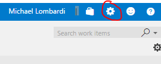
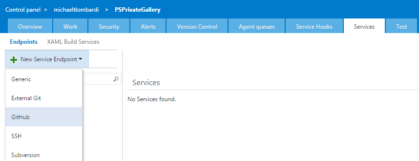
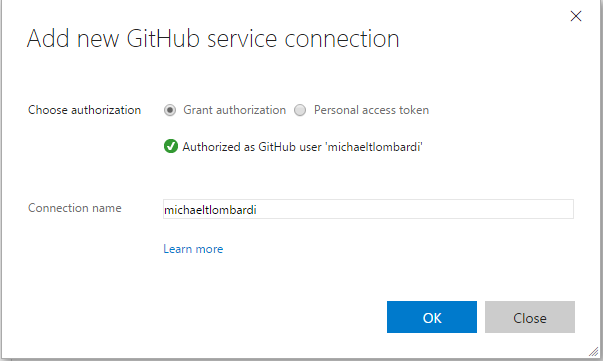
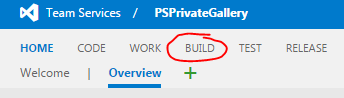
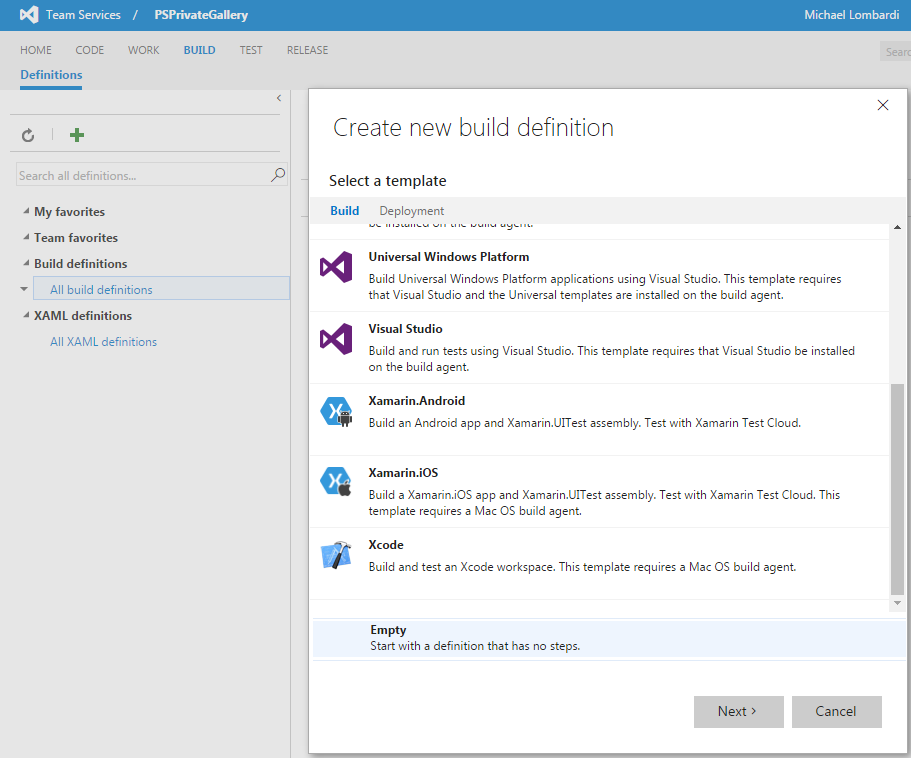
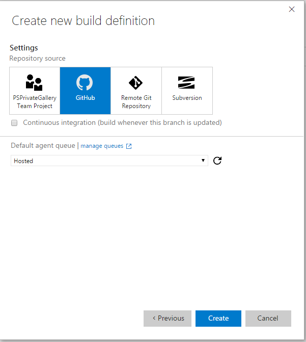

# Adding Your Fork to VSTS
First, navigate to your VSTS project - it should be something like `https://youraccountname.visualstudio.com/PSPrivateGallery` if you set it up during the *Getting Started* tutorial.
Once you're there, click the small cog in the top righthand corner.

This will open a new tab and bring you to the control panel for the project.
Select the 'Services' tab, then click on the 'New Service Endpoint' option on the top left and choose 'Github' from the drop down menu.

On the pop up, click the 'Authorize' button and follow the directions to authenticate, if any.
After authentication, the connection name should automatically populate and you should see a message and green check mark indicated you're authenticated.
Click OK.

Switch tabs back to the your project page and click the menu option for 'BUILD'.

Once on the build page, click the green plus sign on the top left; this will prompt you to create a new build definition.
Select the 'Empty' option at the bottom of the prompt, then click 'Next'.

On the setting page, choose Github and make sure the Default agent queue is set to 'Hosted'. Then click 'Create'.

Select the Repository tab under the Build definition.
You should see that it has autofilled the connection, repository, and default branch.
Change the repository setting to `<yourusername>/PSPrivateGalleryWalkthrough`.

Click the save button.

That's it!
Next, we're going to look at adding an Azure endpoint.