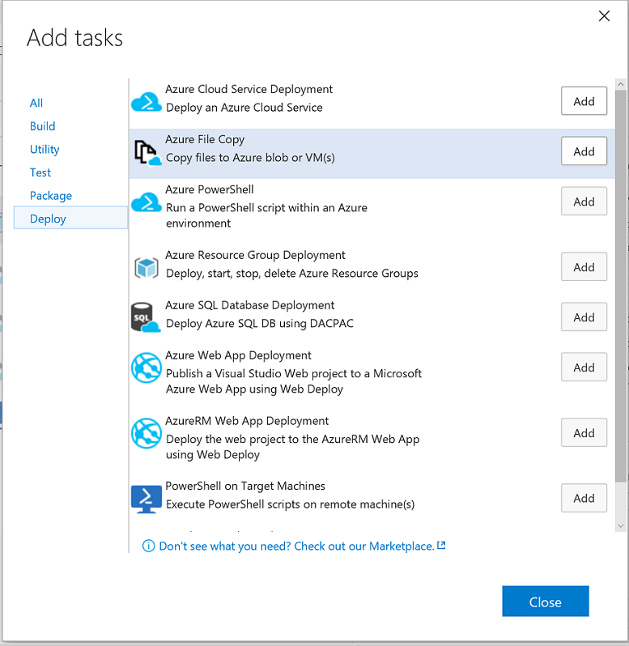

# Creating your Build Defintion
Now we're finally to the interesting part - defining our build.
We're going to set the build up to create the resource group, which will deploy the VM, the network security rules, the network, storage, and DNS entries, as well as apply the Desired State Configurations to the new VM.

## Add the Build Variables
Before we add the build tasks, we need to define some useful variables.

1. Select the 'Variables' tab of the build definition.
2. Select 'Add Variable' and add the following value under the 'Name' column: `resourceGroupName`
3. Select the 'Allow at Queue Time' checkbox.

You're going to add several more variables here, per the table below:

| Name                 | Secret | Allow at Queue Time |
|:---------------------|:------:|:-------------------:|
| resourceGroupName    | false  | true                |
| vmName               | false  | true                |
| vmAdminAccount       | false  | true                |
| vmAdminPassword      | true   | true                |
| galleryAdminPassword | true   | true                |
| galleryUserPassword  | true   | true                |
| galleryApiKey        | false  | true                |
| galleryEmailAddress  | false  | true                |
| galleryName          | false  | true                |

You can place any string you like in for the value of `resourcegroupName`, `vmName`, and `vmAdminAccount`; these will, unsurprisingly, define the name of the Azure resource group to be created (and in which the gallery will reside), the name of the virtual machine the gallery will be installed on, and the name of the admin account created on the VM.

Similarly, you'll want to supply a guid for the GalleryApiKey - this is the API key that members of your organization will use to publish modules to the private gallery.
You may want to mark this as a secret as well, for security purposes.

Speaking of secrets, notice that all of the 'Password' variables are marked as `Secret` - that allows you to safely and securely save the VM Admin's password, the Gallery Admin's password, and the Gallery User's password in the build definition.
You'll be able to unhide them until you save the build definition - at which point you won't be able to retrieve the secret outside of a build.

Finally, you'll want to specify an email address for the private gallery - an organizational mailbox or an individual, depending on the scope of your userbase - and a name for your gallery.

For all of these values we've elected to make them available for overriding at queue time.
That means we're going to be able to specify any/all of them whenever we run a build.

## Add the Resource Group Deployment Task
In your build definition, select the 'Add a Build Step' button.

This will bring up a menu - select the the 'Deploy' tab, and then the 'Azure Resource Group Deployment' option on that tab.

Click the 'Close' button to return to the build.


## Configuring the Resource Group Deployment Task
You'll notice, now that you've added the Resource Group Deployment task, that there's more than a few parts of it to configure!
No worries though, we're going to tackle them one by one.

1. Set the `Azure Connection Type` to 'Azure Resource Manager'
2. Select your subscription from the `Azure RM Subscription` drop-down - it should match your VSTS Service Principal account.
3. Ensure the `Action` is set to 'Create or Update Resource Group'
4. Set `Resource Group` to `$(resourceGroupName)`
5. Set `Location` to wherever you please.
This demo was tested against the East US region, but should work everywhere.
6. Set `Template` to `Templates/azuredeploy.json`
This points to the path for the template so the build knows what to do.
7. Set `Template Parameters` to `Templates/azuredeploy.parameters.json`
This has some default parameters for the build - including VM Size.
8. Set `Override Template Parameters` to '-newStorageAccountName $(vmName) -dnsNameForPublicIP $(vmName) -adminUsername $(vmAdminAccount) -adminPassword (ConvertTo-SecureString -String $(vmAdminPassword) -AsPlainText -Force) -vmName $(vmName)'
*Make sure not to include the wrapping quotation marks though!*
9. Ensure `Enable Deployment Prerequisites` is checked.
10. Set `Resource Group` under the **Output** section to `resourceGroup`.
This will allow us to pass the resource group directly over to the final build step when we're running a PowerShell script on the newly created VM.

Apart from Step 8, most of the steps for configuring the resource deployment are reasonably straight forward.
In that step, we're overriding the parameters as if we were at a PowerShell prompt - because, when this build task runs, we are!

So we specify that the Storage Account should be named for the VM it's attached to, as should the DNS name and, of course, the VM itself!
We give the Admin account a name (specified in the build variables) and then do some work to pass through the password as a secure string.

```PowerShell
ConvertTo-SecureString -String $(vmAdminPassword) -AsPlainText -Force
```

The secret stored in the build system is *not* stored as a secure string, just kept safe until deployment.
So, when we want to pass it in for the VM's admin account password, we need to ensure it gets converted.
Otherwise, the build will error out! 

## Add the Tasks for Copying Files to the Gallery VM
In the repository are some prerequisite files we need to get onto the VM so the configuration can run.
We're going to copy a few PowerShell modules for the DSC resources - one for Package Management, one for SQLExpress, one for IIS, and (of course!) the PSGallery DSC resource.

Then we're going to copy over some installer files these resources will look for - namely, the installers for SQL and an IIS component.

Finally, we're going to copy over the Configuration files themselves!

To do this, we're going to add a build step and navigate to the 'Deploy' tab.
Select the 'Azure File Copy' option, and add it **three** times.
Click okay to close the menu again.



Next, we're going to configure each of these tasks.

## Configuring the First Azure File Copy Task: Pushing the Modules
As before, let's tackle the settings one after another:

1. Set the `Source` to `Modules`.
This ensures that the task will copy the Modules folder from the repository.
2. Set the `Azure Connection Type` to 'Azure Resource Manager'
3. Set the `Azure RM Subscription` to your Service Principal account from the drop down again.
4. Set the `Destination Type` to 'Azure VMs'
5. Set the `RM Storage Account` to `$(vmName)`
6. Set the `Resource Group` to `$(resourceGroupName)`
7. Ensure `Select Machines By` is set to 'Machine Names'.
8. Set the `Admin Login` to `$(vmAdminAccount)`
9. Set the `Password` to `$(vmAdminPassword)`
10. Set the `Destination` to `C:\Program Files\WindowsPowerShell\Modules`
11. Ensure that `Enable Copy Prerequisites` and `Test Certificate` are both checked.
This ensures that you're able to copy the files over to the VM.
Without these settings, the copy will fail - the build server can't copy over HTTP because the newly created Gallery VM isn't in the build server's [Trusted Hosts List](http://www.computerperformance.co.uk/powershell/powershell_wsman.htm).

That's it. 
Now, to configure the next two tasks...

## Configuring the Second Azure File Copy Task: Pushing the Installers
The settings for this task are nearly the same as for the first Azure file copy task.
However, this time we're copying the installers over so steps 1 and 10 (setting the source and destination, respectively) are different.

We've included the full step list again so you don't have to reference back and forth.

1. Set the `Source` to `Installers`.
2. Set the `Azure Connection Type` to 'Azure Resource Manager'
3. Set the `Azure RM Subscription` to your Service Principal account from the drop down again.
4. Set the `Destination Type` to 'Azure VMs'
5. Set the `RM Storage Account` to `$(vmName)`
6. Set the `Resource Group` to `$(resourceGroupName)`
7. Ensure `Select Machines By` is set to 'Machine Names'.
8. Set the `Admin Login` to `$(vmAdminAccount)`
9. Set the `Password` to `$(vmAdminPassword)`
10. Set the `Destination` to `C:\PSPG\Installers`
11. Ensure that `Enable Copy Prerequisites` and `Test Certificate` are both checked.

## Configuring the Third Azure File Copy Task: Pushing the Configuration Files
Last file copy task to configure!
This time, we're copying over the Configuration Environment data files, the scripts which define and execute the configurations, and a controller script (`Execute-ConfigurationScripts.ps1`) which we'll be calling in the final step of this build definition.

1. Set the `Source` to `Configuration`.
2. Set the `Azure Connection Type` to 'Azure Resource Manager'
3. Set the `Azure RM Subscription` to your Service Principal account from the drop down again.
4. Set the `Destination Type` to 'Azure VMs'
5. Set the `RM Storage Account` to `$(vmName)`
6. Set the `Resource Group` to `$(resourceGroupName)`
7. Ensure `Select Machines By` is set to 'Machine Names'.
8. Set the `Admin Login` to `$(vmAdminAccount)`
9. Set the `Password` to `$(vmAdminPassword)`
10. Set the `Destination` to `C:\PSPG\Configuration`
11. Ensure that `Enable Copy Prerequisites` and `Test Certificate` are both checked.

Now we can move on to the final build task!

## Adding the Task to Execute the DSC Configurations
As before, add a build step and navigate to the 'Deploy' tab.
Select 'PowerShell on Target Machines', add one task, and hit okay to close the menu.


This is the final task in the build definition - it will run the `Execute-ConfigurationScripts.ps1` script file on our newly deployed VM.
If you're interested in exactly what it's doing, take a look at [*The PowerShell Private Gallery Configurations*](..\Concepts\The-PowerShell-Private-Gallery-Configurations.md) in the **Concepts** section.

For now, we're just going to focus on the parameters being passed through for the task's configuration.

## Configuring the Remote PowerShell Task
One last list of items to set for the configuration and we're ready to deploy!
Once again, you'll want to make sure the settings for this task are correct:

1. Set the `Machines` to `$(resourceGroup)`.
This is the output of deploying the resource group earlier.
2. Set the `Admin Login` to `$(vmAdminAccount)`
3. Set the `Password` to `$(vmAdminPassword)`
4. Ensure the `Protocol` is set to 'HTTPS' and that the `Test Certificate` option **is** ehecked.
Again, the build server won't be able to reach the new VM over HTTP because it won't be added to the build server's Trusted Hosts list.
5. Set the `PowerShell Script` to `C:\PSPG\Configuration\Execute-ConfigurationScripts.ps1`.
This is why we needed to copy the configuration folder over - we can't run a script that doesn't exist on the target!
6. Set the `Script Arguments` to '-AdminPass $(galleryAdminPassword) -UserPass $(galleryUserPassword) -ApiKey $(galleryApiKey) -EmailAddress $(galleryEmailAddress)'
*Again, make sure not to include the wrapping quotation marks!*

Once more, the complexity is found when we're setting the parameters.
In this case, we're passing through the gallery admin and user passwords we specified back up in the variables section, an ApiKey (used to publish modules to our new repository), and an email address for the gallery admin.

## Conclusion
This was a reasonably long step in the process, but it's the most important one.
Now that we've defined the build, we can actually run it and deploy a private gallery to Azure!

More importantly, if we ever change our minds about any of the variables we used back up in the first section, all we need to do is edit them and redeploy.

Next, we're going to register the repository on our local machine! 